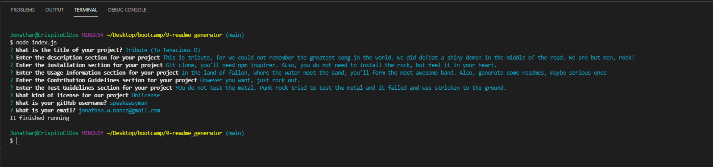

# 9-README-GENERATOR
The Readme generator which is the 3rd week homework assignment

1.0 Title:

    Readme Generator

2.0 Introduction:

    The goal for the 9th week homework assignment was to create a readme generator which 
    will be invoked by running 'node index.js' in the terminal. The program will then 
    provide prompts and using the inputs from those prompts to generate a 'samplereadme.md' file 
    with a table of contents.

3.0 Technologies:

    Node.js is the main technology

4.0 Resources:

    The repo can be found here: 
    https://github.com/speakeasyman/9-readme_generator

    The Demo video is in a subset folder: 
    https://github.com/speakeasyman/9-readme_generator/tree/main/demo%20video

    A sample readme is in a subset folder: 
    https://github.com/speakeasyman/9-readme_generator/tree/main/sample%20Readme

5.0 My Goals:

    To write a program that will create a readme using node.js. Overall this was really cool, 
    my preferred readme file is a little different than that described by the system, so after 
    it is graded I'll probalby edit it to my liking and use it for future projects.

6.0 In use:

    Here is a image of my recorded inputs.  

